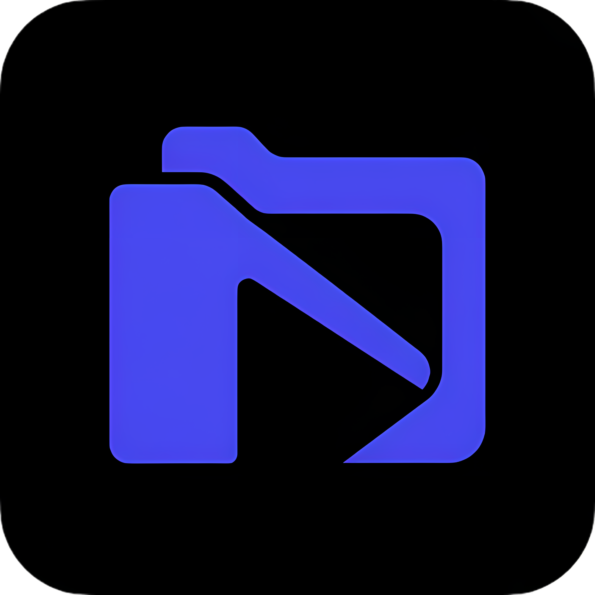

<div align="center">



# Foleyo

**Your offline course player — beautiful, private, distraction-free.**

Watch downloaded video courses in your browser with a real course-platform experience.  
No uploads. No backend. No internet required.

[](https://nextjs.org)
[](https://typescriptlang.org)
[](https://tailwindcss.com)
[](LICENSE)

</div>

---

## ✨ What is Foleyo?

Foleyo turns any folder of downloaded course videos into a structured learning experience — just like Udemy or Coursera, but running **100% locally** in your browser.

Point it at a folder on your Mac, and it instantly creates a course interface with modules, lessons, progress tracking, and a gorgeous video player.

### Why?

- 📂 You downloaded a course but hate scrubbing through folders in Finder
- 🎓 You want a **real course UI** — sidebar, progress bars, autoplay
- 🔒 You care about **privacy** — nothing leaves your machine
- 🌐 You want to learn **offline**, on a plane, in a cabin, anywhere

---

## 🎯 Features

| Feature | Description |
|---|---|
| 📁 **Folder Picker** | Select your course folder via the native file picker — no uploads |
| 🗂️ **Smart Parsing** | Subfolders → modules, video files → lessons, sorted by numeric prefix |
| 🎬 **Video Player** | Built on [vidstack](https://vidstack.io) — keyboard shortcuts, speed control, fullscreen |
| 📊 **Progress Tracking** | Auto-saves position, marks lessons complete, remembers where you left off |
| ▶️ **Autoplay** | Auto-advance through lessons with a cancelable countdown |
| 🕐 **Recently Played** | Resume any previously opened course in one click |
| 🌙 **Dark & Light Mode** | Toggle between themes — preference saved automatically |
| 📱 **Responsive** | Collapsible sidebar, works on smaller screens |
| 💾 **Persistent** | Course handles saved in IndexedDB, progress in localStorage |
| 🔐 **Permission Recovery** | Gracefully re-requests file access on revisit |

---

## 📸 Screenshots

<div align="center">

> _Dark mode welcome screen with recently played courses_

> _Light mode with sidebar and video player_

</div>

---

## 📂 Expected Folder Structure

```
MyCourse/
├── 01_Introduction/
│   ├── 01_Welcome.mp4
│   └── 02_Setup.mp4
├── 02_Core_Concepts/
│   ├── 01_Basics.mp4
│   └── 02_Advanced.mp4
└── 03_Advanced_Topics/
    ├── 01_Patterns.mp4
    └── 02_Best_Practices.webm
```

- **Top-level subfolders** = Modules
- **Video files inside** = Lessons
- Numeric prefixes (`01_`, `02_`) define sort order — they're stripped from display names
- Supports `.mp4`, `.mkv`, `.webm`, `.mov`
- Videos directly in root folder work too (treated as a single "Lessons" module)

---

## 🚀 Getting Started

### Prerequisites

- **Node.js** 18+
- **Chrome** or **Edge** (requires [File System Access API](https://developer.mozilla.org/en-US/docs/Web/API/File_System_Access_API))

### Install & Run

```bash
# Clone the repo
git clone https://github.com/rafiqulshopon/foleyo.git
cd foleyo

# Install dependencies
npm install

# Start the dev server
npm run dev
```

Open [http://localhost:3000](http://localhost:3000) in Chrome or Edge.

### Production Build

```bash
npm run build
npm start
```

---

## 🛠️ Tech Stack

| Technology | Purpose |
|---|---|
| [Next.js 16](https://nextjs.org) | App Router, React framework |
| [TypeScript](https://typescriptlang.org) | Type safety |
| [Tailwind CSS 4](https://tailwindcss.com) | Styling with custom theme |
| [vidstack](https://vidstack.io) | Modern video player component |
| [idb-keyval](https://github.com/nicehash/nicehash-calculator) | IndexedDB wrapper for persisting directory handles |
| File System Access API | Read local files directly in the browser |

---

## ⌨️ Keyboard Shortcuts

| Key | Action |
|---|---|
| `Space` | Play / Pause |
| `←` / `→` | Seek ±5 seconds |
| `↑` / `↓` | Volume up / down |
| `F` | Toggle fullscreen |
| `M` | Toggle mute |

---

## 📁 Project Structure

```
foleyo/
├── app/
│   ├── components/
│   │   ├── header.tsx          # Top bar with progress, autoplay, theme toggle
│   │   ├── sidebar.tsx         # Collapsible sidebar with module/lesson list
│   │   ├── video-player.tsx    # vidstack-based video player
│   │   └── welcome-screen.tsx  # Landing page with folder picker & recent courses
│   ├── context/
│   │   ├── course-context.tsx  # Central state: course data, navigation, progress
│   │   └── theme-context.tsx   # Light/dark mode with localStorage persistence
│   ├── lib/
│   │   ├── parse-course.ts     # Directory → Course data structure parser
│   │   ├── progress-store.ts   # localStorage-based progress tracking
│   │   └── recent-courses-store.ts  # IndexedDB store for recent courses & dir handles
│   ├── types/
│   │   └── file-system.d.ts    # TypeScript declarations for File System Access API
│   ├── types.ts                # Core data types (Course, Module, Lesson, Progress)
│   ├── globals.css             # Theme variables, animations, dark/light mode
│   ├── layout.tsx              # Root layout with fonts
│   └── page.tsx                # Main entry point
├── public/
├── package.json
└── tsconfig.json
```

---

## 🤝 Contributing

Contributions are welcome! Here's how to get started:

### 1. Fork & Clone

```bash
git clone https://github.com/rafiqulshopon/foleyo.git
cd foleyo
npm install
```

### 2. Create a Branch

```bash
git checkout -b feature/your-feature-name
```

### 3. Make Changes

- Follow the existing code style (TypeScript, functional components, React hooks)
- All pages/components must be `'use client'` — this is a fully client-side app
- Use the CSS custom properties from `globals.css` for theming — don't hardcode colors
- Test in both light and dark mode

### 4. Test

```bash
# Type check
npx tsc --noEmit

# Lint
npm run lint

# Dev server
npm run dev
```

### 5. Submit a PR

- Write a clear description of what changed and why
- Include screenshots for UI changes
- Reference any related issues

### Ideas for Contribution

- 🎨 Custom themes / accent color picker
- 📝 Notes per lesson
- 🔍 Search / filter lessons
- 📊 Watch time statistics
- 🖼️ Thumbnail generation
- 📱 PWA support for true offline usage
- 🎧 Audio-only playback mode
- 📋 Subtitle/caption file support (.srt, .vtt)

---

## ⚠️ Known Limitations

- **Browser support**: Only works in Chromium browsers (Chrome, Edge, Brave, Arc) — Firefox and Safari don't support the File System Access API
- **MKV files**: `.mkv` with H.265/HEVC codec may not play in Chrome. H.264 inside MKV works fine. Convert to MP4 (H.264) for guaranteed compatibility
- **No mobile support**: File System Access API is desktop-only
- **Large courses**: Courses with 500+ lessons may take a moment to parse on first open

---

## 📄 License

This project is licensed under the [MIT License](LICENSE).

---

<div align="center">

**Built with ❤️ for offline learners everywhere.**

[Report Bug](https://github.com/rafiqulshopon/foleyo/issues) · [Request Feature](https://github.com/rafiqulshopon/foleyo/issues)

</div>
